# Enterprise Network Security Lab

A segmented enterprise network designed and implemented in Cisco Packet Tracer using VLANs, DHCP, inter-VLAN routing, and router-based access control to enforce network security policies.

## Objective

The objective of this project was to design and implement a small enterprise network that provides reliable connectivity and network segmentation while restricting unauthorized communication between different areas of the network.

The network separates **Employees, Servers, and Guests** into dedicated VLANs and uses router-on-a-stick inter-VLAN routing to provide controlled communication between these networks. An extended Access Control List (ACL) was then implemented to enforce security policies and prevent unauthorized access.

The completed environment was tested to verify that:

* Employees can communicate with authorized server resources.
* Employee devices cannot communicate directly with the Guest network.
* Guest devices cannot communicate with the Employee network.
* Guest devices cannot access the Server network.
* Authorized traffic continues to function normally.

The project demonstrates how **VLAN segmentation, DHCP, inter-VLAN routing, and ACLs** can be combined to create a more controlled and secure enterprise network environment.

## Skills Learned

* Enterprise network design and topology planning
* VLAN creation and network segmentation
* IP addressing and subnet organization
* DHCP configuration and address assignment
* Router-on-a-stick inter-VLAN routing
* Cisco IOS configuration and verification
* Extended Access Control List (ACL) configuration
* Network security policy implementation
* Traffic filtering and network isolation
* ICMP connectivity testing
* Cisco Packet Tracer Simulation Mode
* Network troubleshooting and security-policy validation
* Interpreting ACL match counters and packet behavior
* Network documentation and security evidence collection

## Technologies & Tools Used

* **Cisco Packet Tracer** — Network design, configuration, simulation, and security testing
* **Cisco IOS** — Router and switch configuration
* **VLANs** — Network segmentation
* **DHCP** — Automated IP address assignment
* **802.1Q / Router-on-a-Stick** — Inter-VLAN routing
* **Extended ACLs** — Traffic filtering and access control
* **ICMP** — Connectivity and security testing

## Network Architecture

The network was designed using a segmented enterprise architecture consisting of one router, one managed switch, employee workstations, a server, and a guest workstation.

The network is divided into three primary VLANs:

| VLAN | Name      | Network         | Purpose                     |
| ---: | --------- | --------------- | --------------------------- |
|   10 | EMPLOYEES | 192.168.10.0/24 | Internal employee devices   |
|   20 | SERVERS   | 192.168.20.0/24 | Enterprise server resources |
|   30 | GUEST     | 192.168.30.0/24 | Guest and untrusted devices |

The router provides the default gateway for each VLAN and handles inter-VLAN routing through a router-on-a-stick configuration. The switch connects endpoint devices to their respective VLANs, while the router provides the Layer 3 connectivity and security enforcement point between network segments.

### Topology

The completed topology is shown below.

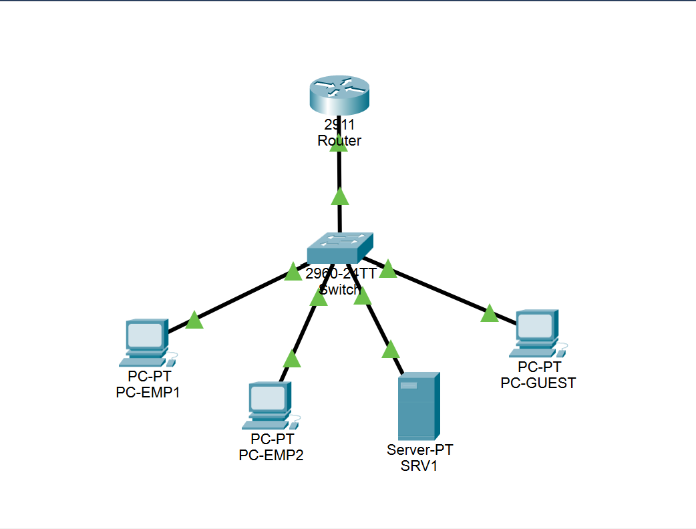

## VLAN Segmentation

VLAN segmentation was used to separate users and resources into distinct logical networks. This reduces the size of broadcast domains and provides a foundation for applying different security policies to each group.

The switch was configured with three primary VLANs:

| VLAN | Name      | Assigned Devices | Network         |
| ---: | --------- | ---------------- | --------------- |
|   10 | EMPLOYEES | PC-EMP1, PC-EMP2 | 192.168.10.0/24 |
|   20 | SERVERS   | Server           | 192.168.20.0/24 |
|   30 | GUEST     | PC-GUEST         | 192.168.30.0/24 |

### VLAN Purpose

**VLAN 10 — Employees**

This VLAN contains internal employee workstations. It represents the trusted user network and is permitted to access authorized server resources.

**VLAN 20 — Servers**

This VLAN isolates server resources from end-user and guest devices. Server resources can be accessed by authorized internal devices while remaining protected from the Guest network.

**VLAN 30 — Guest**

The Guest VLAN is treated as an untrusted network. Guest devices are isolated from both the Employee and Server VLANs through ACL policies implemented on the router.

This segmentation establishes the network boundaries used by the security controls implemented later in the project.

### VLAN Configuration

The following screenshot shows the VLAN configuration on the network switch, including the assignment of endpoint ports to their respective VLANs.

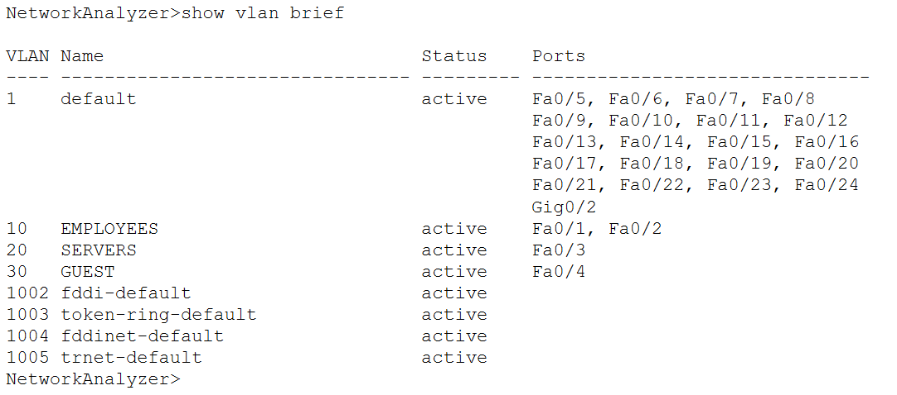

## IP Addressing & DHCP

Each VLAN was assigned its own `/24` IPv4 subnet to maintain clear separation between network segments and simplify address management.

| VLAN | Network         | Default Gateway | Purpose          |
| ---: | --------------- | --------------- | ---------------- |
|   10 | 192.168.10.0/24 | 192.168.10.1    | Employee devices |
|   20 | 192.168.20.0/24 | 192.168.20.1    | Server resources |
|   30 | 192.168.30.0/24 | 192.168.30.1    | Guest devices    |

The router was configured to provide DHCP services for the client VLANs. DHCP allows devices to automatically receive an IP address and appropriate default gateway without requiring each workstation to be manually configured.

The DHCP configuration was organized into separate pools corresponding to the Employee and Guest networks. The Server VLAN uses the dedicated server address `192.168.20.21`.

### Addressing Design

The addressing scheme provides a predictable relationship between each VLAN and its subnet. The third octet identifies the VLAN, making the network easier to understand and troubleshoot.

For example:

* `192.168.10.x` → Employee network
* `192.168.20.x` → Server network
* `192.168.30.x` → Guest network

This structure also makes the ACL security policies easier to define because each security zone is represented by a distinct subnet.

### DHCP Configuration

The following screenshot shows the DHCP configuration used to provide automatic addressing for network clients.

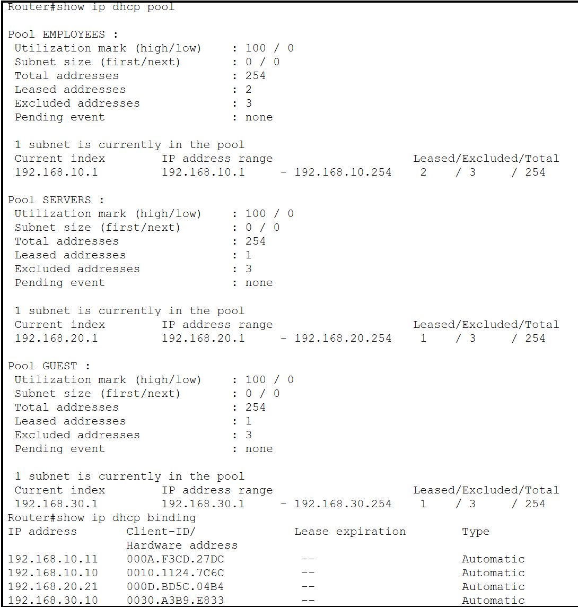

## Inter-VLAN Routing

Because each VLAN uses a separate IP subnet, communication between VLANs requires a Layer 3 routing device. The router was configured using a **router-on-a-stick** design, allowing a single physical router interface to provide connectivity for multiple VLANs.

The switch-to-router connection uses an 802.1Q trunk to carry traffic for VLANs 10, 20, and 30. The router then uses separate subinterfaces to act as the default gateway for each VLAN.

| Interface             | VLAN | IP Address   | Role             |
| --------------------- | ---: | ------------ | ---------------- |
| GigabitEthernet0/1.10 |   10 | 192.168.10.1 | Employee gateway |
| GigabitEthernet0/1.20 |   20 | 192.168.20.1 | Server gateway   |
| GigabitEthernet0/1.30 |   30 | 192.168.30.1 | Guest gateway    |

The subinterfaces allow the router to identify the VLAN associated with each packet and route traffic between the corresponding IP networks.

### Routing Verification

The router's interface configuration was verified using:

```text
show ip interface brief
```

The VLAN subinterfaces were operational and displayed the expected gateway addresses.

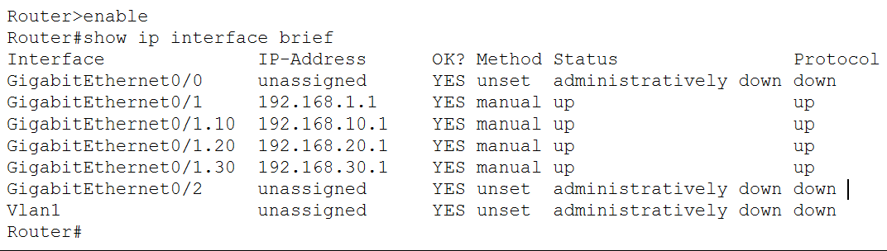

Inter-VLAN routing provides the connectivity required for legitimate communication while also providing the point where security policies can be enforced.

## ACL Security

To enforce communication restrictions between the VLANs, an extended Access Control List named `VLAN-SECURITY` was configured on the router.

The ACL was designed around the principle of **least privilege**. Instead of allowing unrestricted communication between all network segments, traffic between trusted, protected, and untrusted networks was explicitly controlled.

### Security Policy

The implemented ACL contains the following rules:

| Source Network | Destination Network | Action | Purpose                                                           |
| -------------- | ------------------- | ------ | ----------------------------------------------------------------- |
| Employees      | Guests              | Deny   | Prevent internal employee traffic from reaching the Guest network |
| Guests         | Employees           | Deny   | Prevent Guest devices from accessing internal employee systems    |
| Guests         | Servers             | Deny   | Prevent Guest devices from accessing protected server resources   |
| Any            | Any                 | Permit | Allow other traffic not explicitly restricted by the ACL          |

The primary network isolation rules are:

```text
deny ip 192.168.10.0 0.0.0.255 192.168.30.0 0.0.0.255
deny ip 192.168.30.0 0.0.0.255 192.168.10.0 0.0.0.255
deny ip 192.168.30.0 0.0.0.255 192.168.20.0 0.0.0.255
```

The final `permit ip any any` statement allows traffic that is not explicitly prohibited by the security policy.

### ACL Placement

The ACL was applied to the router interface used for inter-VLAN traffic so that routed traffic between the segmented networks could be evaluated against the security policy.

This design allows the router to function as both the inter-VLAN routing device and the enforcement point for network access controls.

### Configuration Verification

The ACL configuration was verified using:

```text
show access-lists VLAN-SECURITY
```

The following screenshot shows the configured ACL and its security rules.

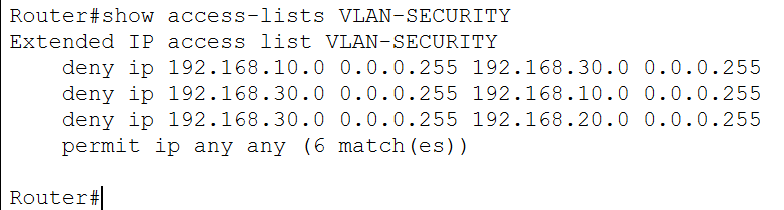

## Security Testing & Results

After configuring the VLANs, routing, DHCP, and ACL security policies, the network was tested using ICMP traffic in Cisco Packet Tracer. The tests were designed to verify both **authorized communication** and **blocked communication**.

### Test Results

| Test              | Expected Result | Actual Result |
| ----------------- | --------------- | ------------- |
| Employee → Guest  | Blocked         | ✅ Blocked     |
| Guest → Employee  | Blocked         | ✅ Blocked     |
| Guest → Server    | Blocked         | ✅ Blocked     |
| Employee → Server | Allowed         | ✅ Successful  |

The results demonstrate that the ACL successfully enforces the intended network boundaries while allowing authorized Employee-to-Server communication.

### Employee → Guest: Blocked

An ICMP test was performed from an Employee workstation to the Guest network. The packet reached the router and was denied by the `VLAN-SECURITY` ACL.

The PDU information confirmed that the packet matched the following rule:

```text
deny ip 192.168.10.0 0.0.0.255 192.168.30.0 0.0.0.255
```

The packet was therefore dropped before it could reach the Guest device.

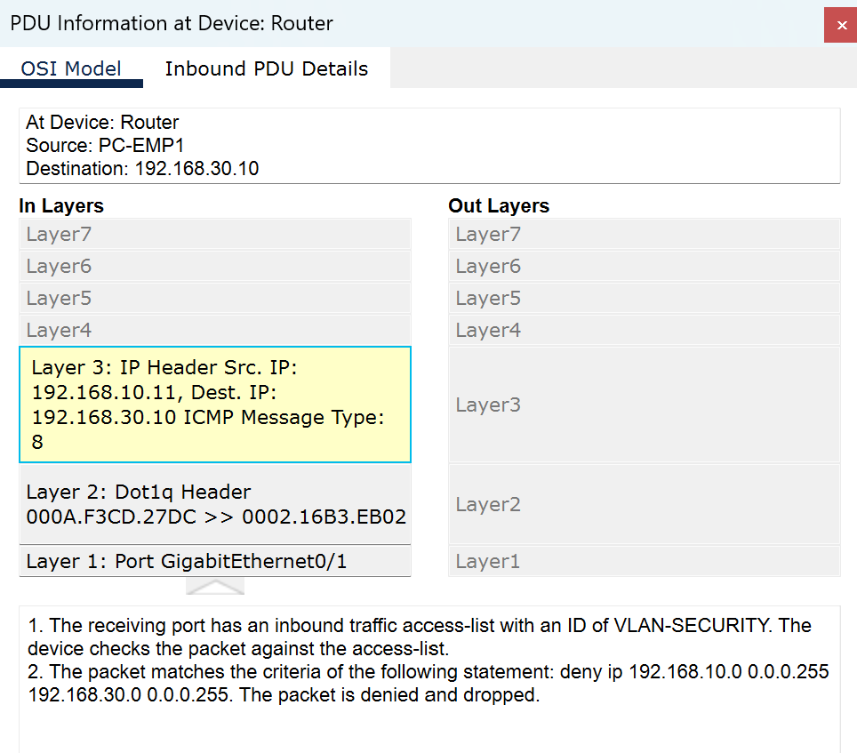

The Simulation Mode event list and topology provide additional visual evidence of the packet being stopped at the router.

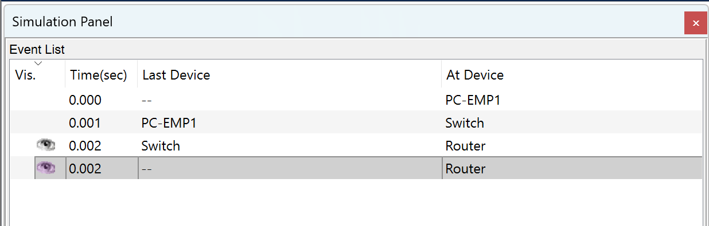

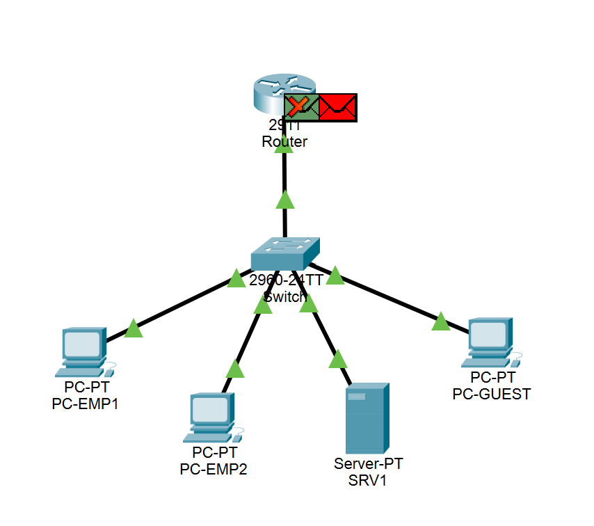

### Employee → Server: Allowed

A connectivity test was performed from an Employee workstation to the Server VLAN. The ICMP request successfully reached the server and received replies.

This confirms that the ACL allows legitimate internal access to authorized server resources.

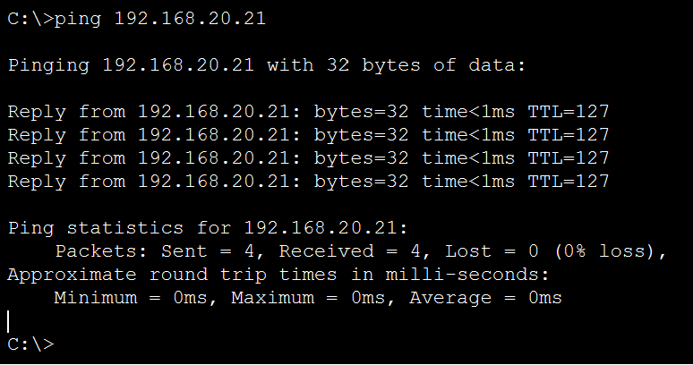

### Guest → Server: Blocked

A connectivity test was performed from the Guest network toward the Server network. The traffic was blocked as intended by the ACL.

This demonstrates that Guest devices cannot directly access protected server resources.

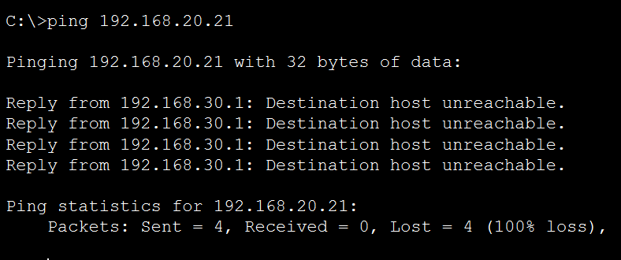

### Test Summary

The testing confirmed that the implemented security policy operated as designed. Unauthorized communication between the Guest and Employee networks was blocked, Guest access to the Server network was restricted, and authorized Employee-to-Server communication remained functional.

## ACL Verification

The ACL was verified after completing the connectivity and security tests by examining its match counters with:

```text
show access-lists VLAN-SECURITY
```

The final ACL counters provide additional evidence that the security rules were actively matched during testing.

The Employee-to-Guest deny rule recorded **9 matches**, confirming that traffic from the Employee network toward the Guest network was evaluated and denied.

The Guest-to-Employee deny rule recorded **4 matches**, confirming that traffic from the Guest network toward the Employee network was also blocked.

The Guest-to-Server deny rule recorded **4 matches**, confirming that Guest traffic attempting to reach the protected Server network was denied.

The `permit ip any any` statement recorded **24 matches**, demonstrating that other traffic not explicitly prohibited by the security policy was permitted.

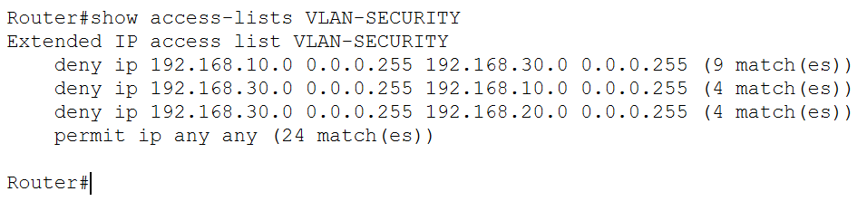

These counters provide additional verification that the ACL was actively enforcing the intended network restrictions during testing.

## Key Takeaways

This project demonstrated how multiple network security controls can be combined to create a segmented enterprise network.

VLANs established logical separation between Employees, Servers, and Guests. Router-on-a-stick inter-VLAN routing provided the necessary connectivity between these networks while creating a centralized point for traffic inspection and policy enforcement.

The `VLAN-SECURITY` extended ACL then enforced the required restrictions by blocking unauthorized communication between the Employee and Guest networks and preventing Guest devices from accessing the Server network.

Testing and ACL match counters verified that the implemented controls operated as intended rather than relying solely on successful device configuration.

## Conclusion

The completed network demonstrates a practical approach to enterprise network segmentation and access control. Instead of relying solely on physical separation, the design combines VLANs, routing, DHCP, and ACL-based traffic filtering to establish and enforce boundaries between different security zones.

The project also demonstrates the importance of validating security configurations through testing. Connectivity tests, Packet Tracer Simulation Mode, PDU analysis, and ACL match counters were used together to verify that unauthorized traffic was blocked while authorized communication remained available.

## Project Files

The completed Cisco Packet Tracer simulation is included in the `packet-tracer/` directory.

The project file contains the implemented topology, VLAN configuration, DHCP services, inter-VLAN routing, and ACL security policies documented throughout this repository.

The `screenshots/` directory contains the configuration and testing evidence referenced in this README.
